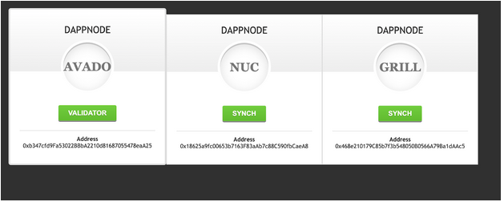

# Archipel Solution

## Demo

## Introduction
We hack on a solution to resolve high availability problem of Validator nodes in PoS.
This project will allow anyone to build its own highly available Validator setup.

We joined together 3 Dappnode hardware nodes. All of them are running a Polkadot node, but only one is validator. Two others nodes are only synching Polkadot chain.

To see how it works and what is going on, we created a Web UI which shows the current validator state.

## Hardware

Our hardware setup looks like this.
It includes:
* 3 Dappnodes (Runs Archipel Orchestrator and Polkadot node)
* Raspberry Pi 3B (Plays the role of router)
* Switch (Links all together)

## Archipel Web UI

Here we can see that Avado Dappnode is the current validator and two others are only synching the chain state. If validator state changes the Web UI will be updated automatically.

Web UI was deployed at IPFS:

* https://ipfs.io/ipfs/QmWxQgqDjMHUzwM3bG8Gxfd2CvQKVKLeG79UgKvZsu73WN/

Source Code of Web UI:

* https://github.com/branciard/eth-berlin-2019-archipel/tree/master/monitoring/client

## Archipel Orchestrator
Archipel Orchestrator is the main component of Archipel solution.

It watches the blockchain and pings other nodes. Then it switches the validator mode if necessary.

#### DAppNode package

* /ipfs/QmPk2xBHaHbrjYYz7Y5oDpWuNp6sEqpyxkTJ91QQsm7xio

## Polkadot Telemetry

When Archipel is up we can see 3 nodes in the Polkadot telemetry. We can see that the “archipel-avado” node is in Validator mode. All other nodes are just synching. If the “archipel-avado” will become unavailable, the other one will take the relay and will become the new validator. Internally “archipel-avado” will pass in only synching state.

## Blockchain Part
To select the next leader we need have a shared state between Archipel nodes. For this purpose we choose to use a smart contract to synchronize the state between 3 nodes:
* https://github.com/branciard/eth-berlin-2019-archipel/blob/master/chain/contracts/Archipel.sol

We have tested it and deployed it on Goerli and Skale sidechain.
Skale sidechain allow us to have a faster response for the High availability switch.
#### Skale deploy
* https://github.com/branciard/eth-berlin-2019-archipel/tree/master/chain#skale-chain-deploy-

#### Goerli deploy
* https://goerli.etherscan.io/address/0xbecfb5499a9488e445e89c5134aef60d3a2a7147#code
